# HRMS

[English](README.md) · [Русский](README.ru.md) · [Deutsch](README.de.md) · 🌐 [Landing](https://dripips.github.io/rubby-hrms/de/)

**Universelles HRMS für jede Branche — vom Tech-Startup bis zum Klärgrubenservice.** Open Source, selbst-hostbar, KI-gestützt, regulator-freundlich (152-FZ, DSGVO).

Rails 8 · Hotwire · 24 KI-Agenten · Apple-HIG · Drei Sprachen · Ein-Befehl-Docker-Installation.

   

---

## Warum

Die meisten HR-Systeme verankern das Vokabular einer Branche im Code. Ein Mitarbeiter ist „Entwickler", ein Urlaub ist „PTO", ein Dokument ist „Pass". Echte Unternehmen sind komplizierter — ein Klärgrubenservice braucht Führerscheinklassen und ADR-Berechtigungen; eine Privatklinik braucht Lizenznummern; ein Tech-Startup will GitHub-URLs. Jedes Unternehmen ist *seine* Version von HR.

**HRMS passt sich dem Unternehmen an, nicht umgekehrt.** Jede Entität (Mitarbeiter, Position, Dokument, Urlaubsantrag, Kandidat, Abteilung) hat einen universellen **Zusatzfelder**-Mechanismus über Wörterbücher. HR definiert das Schema einmal — Formulare, Validierung, KI-Extraktion und Audit übernehmen es automatisch.

## Highlights

- 🌍 **Universell über Branchen.** Zusatzfelder pro Entität, konfigurierbare Auswahllisten, alles unternehmensbezogen.
- 🪄 **24 KI-Agenten** für den vollen Mitarbeiterzyklus, funktionieren mit **jedem OpenAI-kompatiblen Endpoint** — OpenAI, OpenRouter, Together, Groq, DeepSeek, vLLM, Ollama, eigener Server.
- 📄 **Dokumenten-Subsystem** mit Auto-Parsing (pdf-reader + Tesseract OCR + OpenAI Vision Fallback), KI-Zusammenfassung, Ablauf-Tracking, E-Mail-Benachrichtigungen.
- 🤖 **KI-Bootstrap-Chat** — beschreibe dein Unternehmen in natürlicher Sprache, KI schlägt das vollständige Set an Feldern und Wörterbüchern vor. Genehmige was du willst.
- ⚡ **Live-UI** — jede Änderung streamt über Turbo + ActionCable. Keine Seitenaktualisierungen.
- 🎨 **Apple-HIG Designsystem** — Systemfarben, SF Pro Typografie, Spring-Animationen.
- 🌐 **Drei Sprachen (RU / EN / DE)** mit automatischer Fallback-Kette. Sprachbewusste KI-Ausgabe.
- 📊 **Cost Dashboard** — KI-Echtkosten nach Aufgabe, Modell, Benutzer.
- 🔐 **Audit Log** + Pundit RBAC + Soft-Delete + Revert.
- 📧 **E-Mail-Benachrichtigungen** mit zur Laufzeit konfigurierbarem SMTP über UI.
- 🐳 **Ein-Befehl-Docker-Installation** mit automatisch generierten Secrets.

## Screenshots

### Dashboard
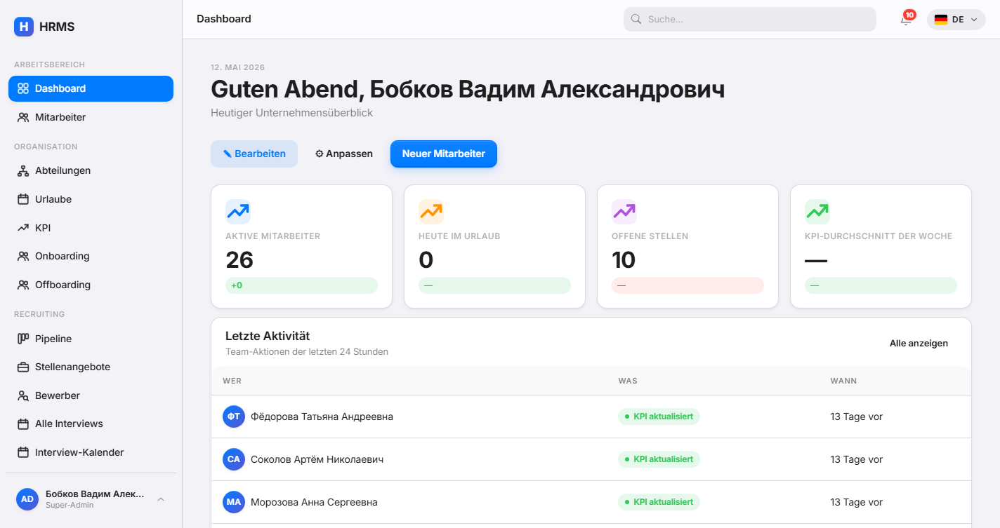

### Recruitment Kanban
Drag-and-Drop Pipeline. KI bewertet jeden Kandidaten beim Lebenslauf-Upload.
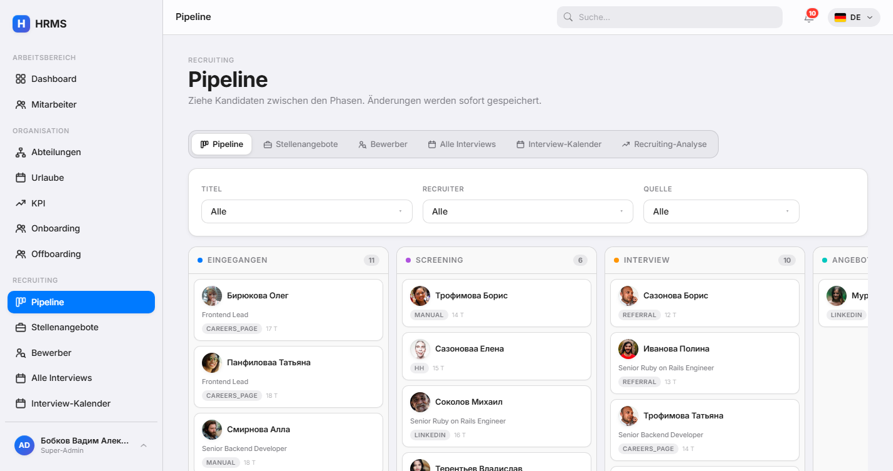

### Recruitment Analytics
Conversion-Funnel, Zeit in Phase, Recruiter-Performance.
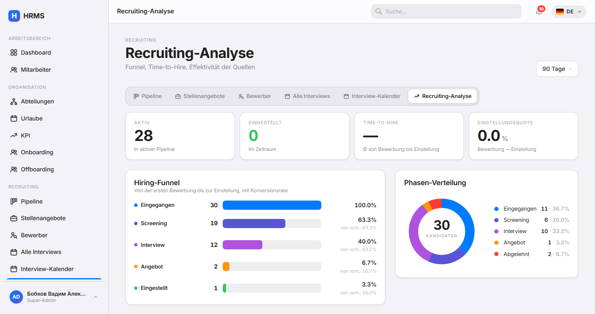

### Interview-Kalender
FullCalendar 6 mit Hover-Popover, Drag-to-Create, Agenda.
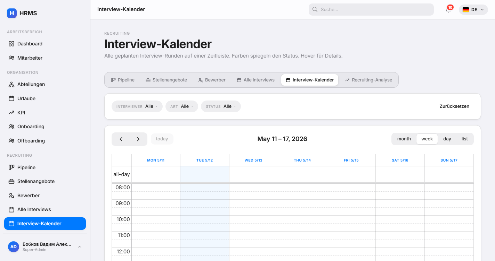

### KPI Dashboard
Wöchentliche Zuweisungen, Bewertungen, Trend, KI-Brief-Generator.
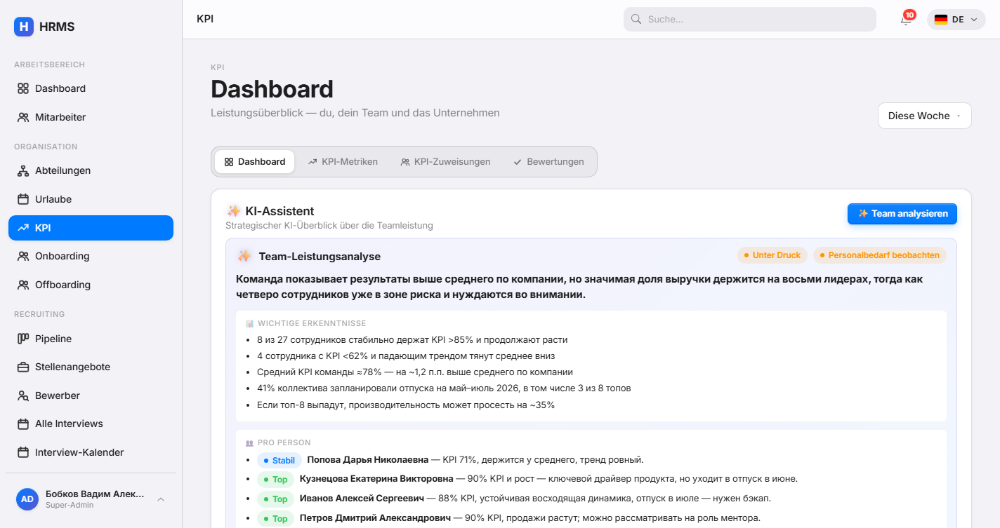

### Dark Mode
Volle Unterstützung — gilt für alle Bildschirme.

| Dashboard | Recruitment Kanban |
|---|---|
| 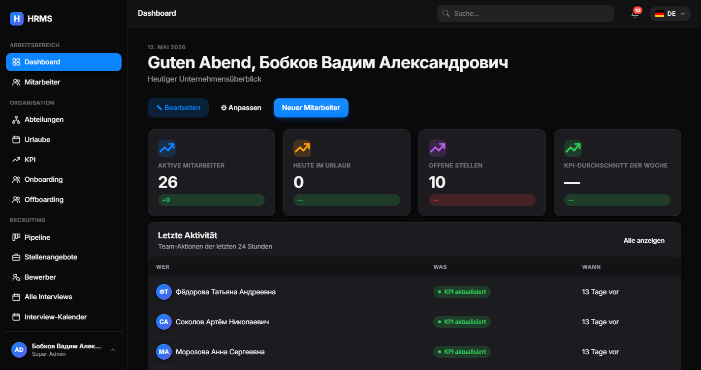 | 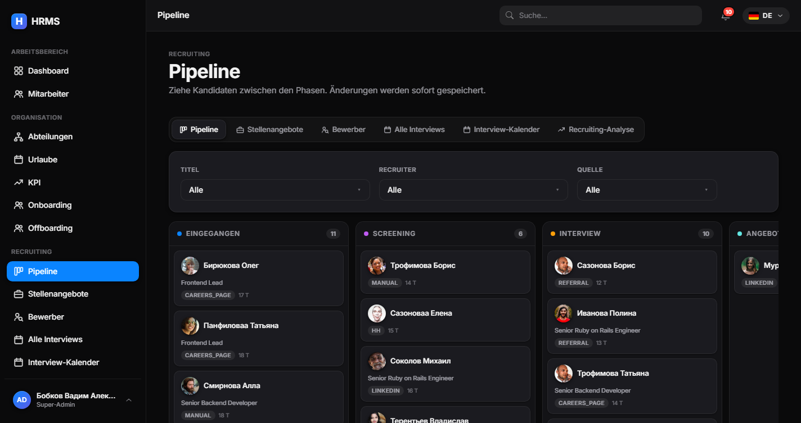 |

| KPI | Interview-Kalender |
|---|---|
| 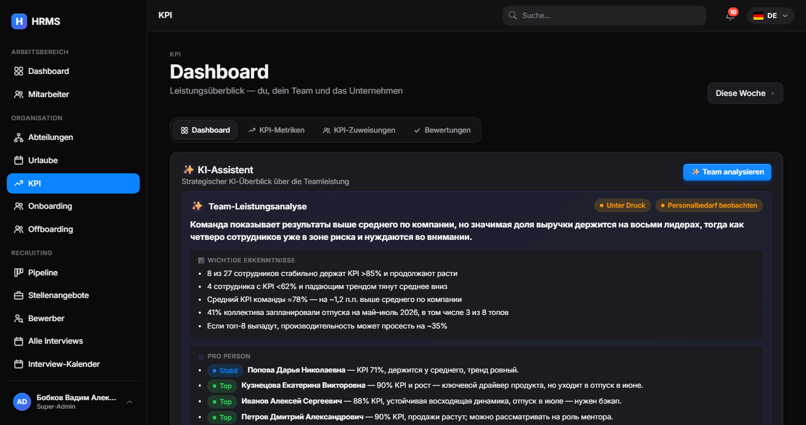 | 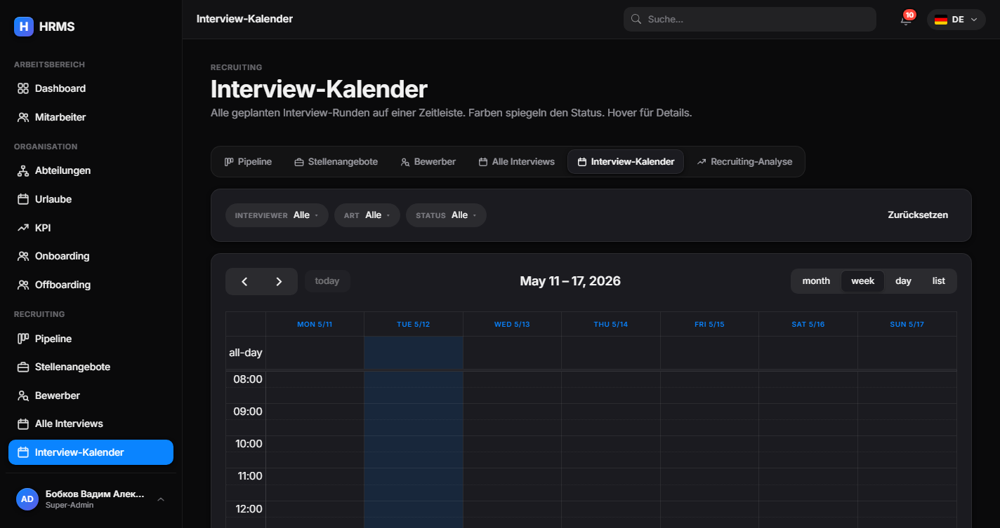 |

<details>
<summary><strong>Mehr Screenshots</strong></summary>

#### Mitarbeiter
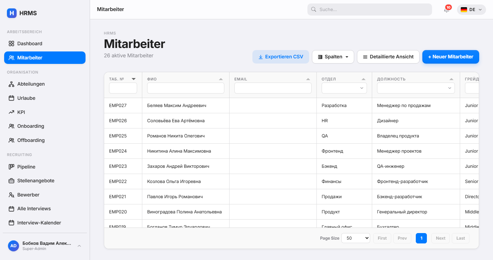

#### Urlaubsanträge
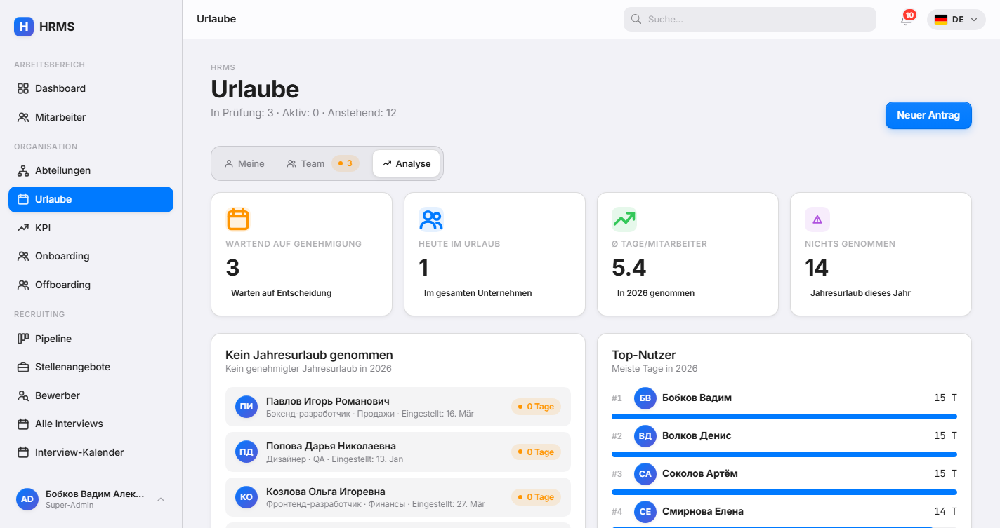

#### Dokumente
Upload → parsen (pdf-reader + Tesseract + Vision API) → Review → Anwenden.
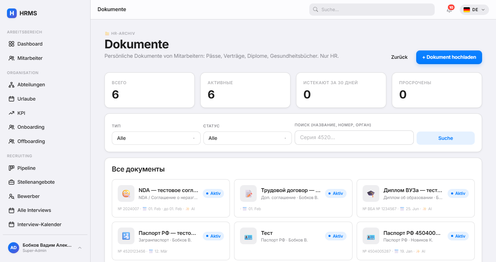

#### Onboarding-Prozesse
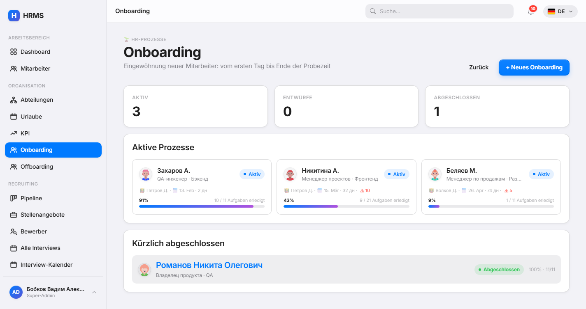

#### Audit-Log
Jede Modelländerung verfolgt + reversibel.
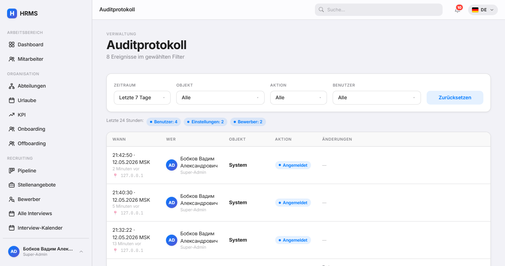

#### Self-Service-Profil
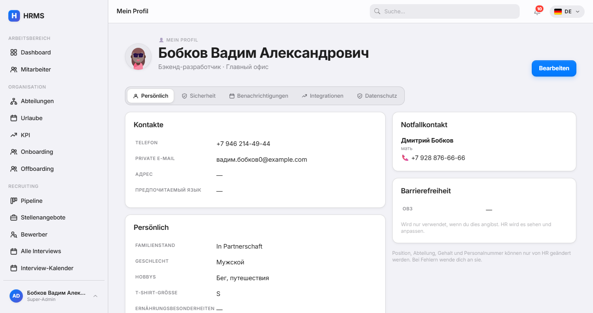

#### Slack + Telegram Integrationen
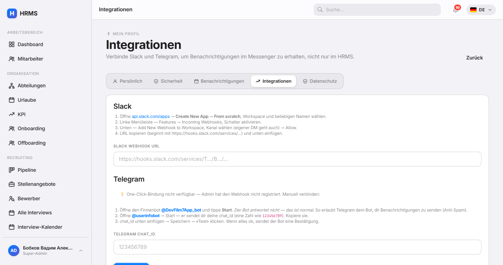

#### Einstellungen — Sprachen
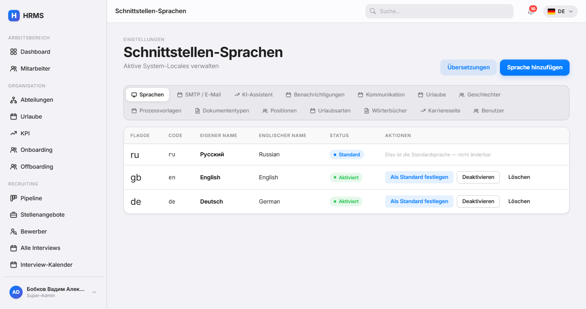

#### Einstellungen — KI-Provider
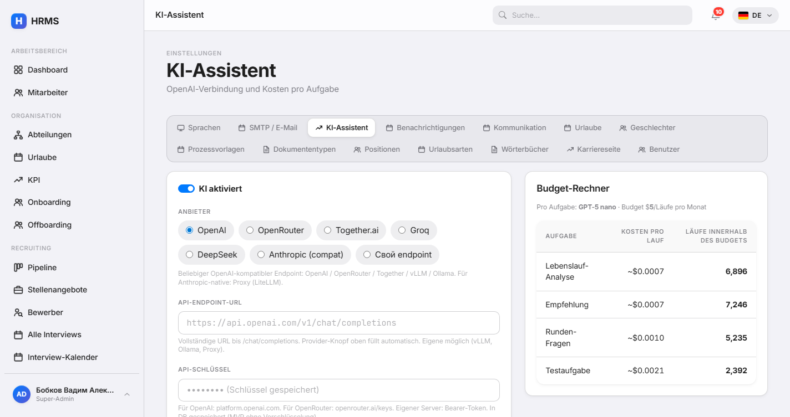

#### KI-Runs-Log
Jeder KI-Aufruf: Tokens, Kosten, Modell, Prompt, Response, Status.
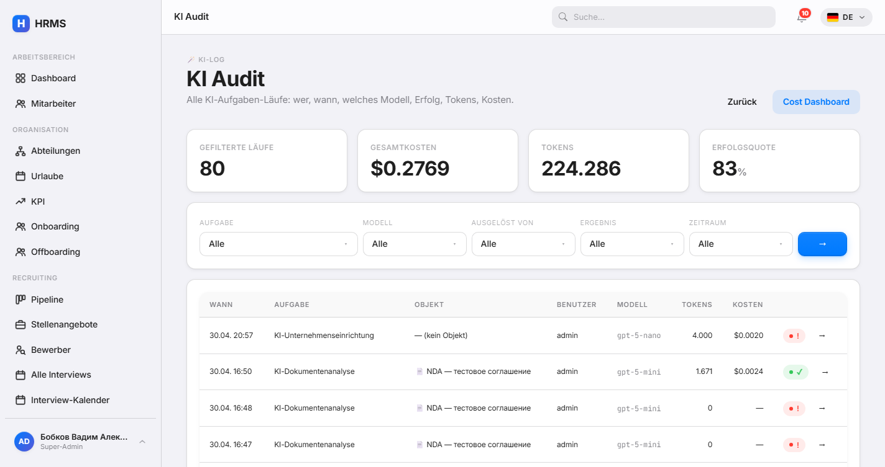

</details>

> Neu generieren? Bei laufendem Server `bin/rails screenshots` ausführen. Der Rake-Task meldet sich als Admin an und erstellt alle Hauptseiten in 1440×900 für drei Locales (RU / EN / DE) + Dark-Varianten der Hero-Screens unter `docs/screenshots/{ru,en,de}/`.

## Schnellinstallation (Docker)

```bash
git clone https://github.com/dripips/hrms.git
cd hrms
./scripts/install.sh
```

Das war's. Der Installer:

1. Generiert zufälligen `RAILS_MASTER_KEY` und PostgreSQL-Passwort
2. Baut das Image (Tesseract OCR + Poppler + libvips inklusive)
3. Startet `db + app + worker`-Container
4. Erstellt den ersten Superadmin
5. Gibt URL und Zugangsdaten aus

Öffne http://localhost:3000 und melde dich an.

## Module

| Modul | Was es tut |
|---|---|
| **Dokumente** | Hochladen, Auto-Parsing (gem regex + KI Vision), mit Bearbeitung anwenden, Ablauf-Benachrichtigungen |
| **Recruiting** | Stellen, Bewerber, Kanban-Pipeline, Interview-Runden mit Scorecards, öffentliche Karriereseite, Kalender, Analytics |
| **KPI** | Wöchentliche Metrik-Zuweisungen, Bewertungen, Leaderboard, Trend-Dashboard |
| **Urlaube** | Konfigurierbare Genehmigungsregeln mit Prioritätsketten, Saldoverfolgung, Burnout-Analyse |
| **Onboarding / Offboarding** | Prozessvorlagen mit nach Meilensteinen gruppierten Aufgaben, KI-erweiterte Pläne, Austrittsrisiko |
| **Wörterbücher** | Universelle unternehmensbezogene Auswahllisten + Zusatzfeld-Schemas + KI-Seed |
| **Audit Log** | Jede Änderung verfolgt + revertierbar; KI-Lauf-Verlauf mit Drill-Downs |
| **Profil** | Self-Service-Portal — Mitarbeiter bearbeiten eigene Kontakte, Notfallkontakt, Barrierefreiheit |
| **Einstellungen** | Sprachen, SMTP, KI-Anbieter (OpenAI / OpenRouter / Anthropic / eigener), Benachrichtigungen, Karriereseite, Urlaubsregeln, Dokumententypen, Positionen, Urlaubsarten |

## Custom-Fields-System

Jede Entität unterstützt `custom_fields` (jsonb). Schemas werden als **Wörterbücher** definiert mit `kind: field_schema` und `code: "<Modell>:<scope>"`.

Beispielablauf für einen Klärgrubenservice:

```
HR öffnet /settings/dictionaries
  → "+ Schema" → Code: Employee:default
  → KI-Helfer: "Klärgrubenservice in Moskauer Region, 12 Fahrer, obligatorisches Gesundheitsbuch"
  → KI schlägt 5 Felder vor:
      - driver_license_class (select: B, C, D, E)
      - adr_license_until (Datum)
      - medical_book_until (Datum, erforderlich)
      - hazardous_work_clearance (boolean)
      - uniform_size (select)
  → Alle genehmigen → Felder erscheinen sofort in jedem Mitarbeiterformular.
```

Derselbe Mechanismus funktioniert für `Document:N` (ein Schema pro Dokumenttyp), `JobApplicant:opening_id` (pro Stelle), `LeaveRequest:leave_type_id`, `Department:default`, `Position:default`, `LeaveType:default`.

## KI-Agenten

24 Agenten über den Lebenszyklus. Zwei neueste:

- **`company_bootstrap`** — Chat-Berater, der HR über das Unternehmen interviewt und die vollständige Wörterbuch-Konfiguration vorschlägt
- **`dictionary_seed`** — füllt Einträge für ein bestimmtes Wörterbuch

Plus der Lebenszyklus:

| Bereich | Agenten |
|---|---|
| Recruiting | `analyze_resume`, `recommend`, `generate_assignment`, `questions_for`, `summarize_interview`, `compare_candidates`, `offer_letter` |
| Mitarbeiterbindung | `burnout_brief`, `suggest_leave_window`, `kpi_brief`, `meeting_agenda`, `kpi_team_brief`, `compensation_review`, `exit_risk_brief` |
| Onboarding | `onboarding_plan`, `welcome_letter`, `mentor_match`, `probation_review` |
| Offboarding | `knowledge_transfer_plan`, `exit_interview_brief`, `replacement_brief` |
| Dokumente | `document_summary`, `document_extract_assist` (mit Vision API für Bilder) |

Ein serverseitiges **AiLock** verhindert doppelte Läufe über Browser-Tabs hinweg.

### KI-Anbieter

Wechsel die Anbieter unter **Einstellungen → KI**. Vorkonfigurierte Presets:

- OpenAI (Standard) — `gpt-5-nano`, `gpt-5-mini`, `gpt-5`, `o3`
- OpenRouter — Qwen, Claude, Llama, DeepSeek, Gemini
- Together.ai — Qwen-Turbo, Llama-Turbo, DeepSeek-V3
- Groq — Llama-3.3, Qwen-QwQ, DeepSeek-R1
- DeepSeek (nativ)
- Anthropic (über LiteLLM-Proxy)
- Custom — beliebiger OpenAI-kompatibler Endpoint (vLLM, Ollama, dein Inferenzserver)

Modell-Override pro Aufgabe: `gpt-5-mini` für `company_bootstrap` (besser bei mehrstufigem Reasoning) und `gpt-5-nano` für alles andere (günstig und schnell).

## Stack

- **Rails 8.1** + Hotwire (Turbo, Stimulus) + Bootstrap 5.3 (überschrieben durch Apple-Designtokens)
- **PostgreSQL 18** + Solid Queue + Solid Cable
- **Devise** + **Pundit** + **paper_trail** + **Discard** + **AASM**
- **noticed** für In-App-Benachrichtigungen + E-Mail-Mailer
- **pdf-reader** + **rtesseract** für Dokumentenparsing
- **dartsass-rails** + Designsystem als Submodul
- **RSpec** + FactoryBot + Capybara

## Manuelle Installation (ohne Docker)

Voraussetzungen: **Ruby 4.0.3**, **PostgreSQL 18**, **Tesseract OCR** (mit `tesseract-ocr-rus` und `tesseract-ocr-eng`), **Poppler** (`pdftoppm` für Scan-PDF-OCR).

```bash
git clone https://github.com/dripips/hrms.git
cd hrms

# Konfiguriere die Datenbank in config/database.yml oder .env.development.local
bundle install
bin/rails db:create db:migrate db:seed

bin/dev   # Rails + dartsass watcher + Solid Queue
```

Standardmäßig erstellte Benutzer (Passwort: `password123`):
- `admin@hrms.local` — Superadmin
- `hr@hrms.local` — HR-Spezialist
- `manager@hrms.local` — Manager
- `alice@hrms.local` — regulärer Mitarbeiter

## Architektur-Hinweise

- **Live UI**: Controller-Aktionen senden über `Turbo::StreamsChannel`. KI-Jobs verwenden `AiLock` + `broadcast_controls` für In-Flight-Indikatoren pro Tab.
- **i18n**: Russisch primär; EN/DE fallen auf RU zurück. Alle drei Sprachen auf exakter Schlüsselparität (2094 Schlüssel je v1.0).
- **KI-Kostenobergrenze**: jeder AiRun zeichnet Token-Verbrauch und Dollar-Kosten auf. Einstellungen → KI zeigt pro Aufgabe / pro Modell-Aufschlüsselung des aktuellen Monats.
- **SMTP-Laufzeit-Konfiguration**: `ApplicationMailer#apply_runtime_smtp` liest `AppSetting(category: "smtp")` pro Anfrage — SMTP über UI ändern ohne Neustart.
- **Kein 2FA** by design (noch nicht) — basiert auf starken Passwörtern + RBAC. Über Devise-Extension hinzufügen, falls für Produktion erforderlich.

## Roadmap

- ☐ Multi-Tenant Routing (Subdomain pro Unternehmen)
- ☐ Mobile-first Review-Screen
- ☐ Slack/Telegram-Kanal für Benachrichtigungen
- ☐ Verbesserungen am öffentlichen Job-Board
- ☐ RSpec-Abdeckung auf >80% erhöhen
- ☐ PDF-Scan→OCR-Pipeline (poppler + Tesseract für Bild-PDFs)

## Beitragen

Pull Requests willkommen. Das Projekt folgt Apple-HIG SCSS-Tokens — kein nacktes Bootstrap. Animationen müssen Spring-Easing verwenden. Neue i18n-Schlüssel werden in alle drei Sprachen gleichzeitig hinzugefügt (`tmp/sync_locales.rb` ist ein Helper-Skript für Bulk-Hinzufügungen).

## Lizenz

MIT — siehe [LICENSE](LICENSE).

## Autor

[Vadim Bobkov](https://github.com/dripips) — entwickelt als Teil des [`rubby`](https://github.com/dripips?tab=repositories&q=rubby) Lern-Projekts, parallel zur Produktionsarbeit in PHP, Java, Python und TypeScript.
