# HRMS

[English](README.md) · [Русский](README.ru.md) · [Deutsch](README.de.md)

**Universal HRMS for any industry — from a tech startup to a septic-pumping company.** Open source, self-hostable, AI-powered, regulator-friendly (152-FZ, GDPR-aware).

Rails 8 · Hotwire · 24 AI agents · Apple-HIG · Three locales · One-command Docker install.

   

---

## Why this exists

Most HR systems hardcode one industry's vocabulary. A hire is a "developer", a leave is "PTO", a document is a "passport". Real companies are messier — a septic-pumping company needs to track driver license categories and ADR clearances; a private clinic needs licence numbers; a tech startup wants GitHub URLs. Every company is *its* version of HR.

**HRMS makes the system bend to the company, not the company to the system.** Every entity (Employee, Position, Document, LeaveRequest, JobApplicant, Department) has a universal **Custom Fields** mechanism through Dictionaries. HR defines the schema once — forms, validation, AI extraction, and audit pick it up automatically.

## Highlights

- 🌍 **Universal across industries.** Custom fields per entity, configurable lookup lists, all company-scoped.
- 🪄 **24 AI agents** for the full employee lifecycle, working on **any OpenAI-compatible endpoint** — OpenAI, OpenRouter, Together, Groq, DeepSeek, vLLM, Ollama, your own server.
- 📄 **Documents subsystem** with auto-parsing (pdf-reader + Tesseract OCR + OpenAI Vision fallback), AI summary, expiry tracking, email notifications.
- 🤖 **AI Company Bootstrap chat** — describe your company in plain language, AI proposes the full set of fields and dictionaries tailored to your industry. Approve what you want.
- ⚡ **Live UI** — every change streams via Turbo + ActionCable. No page reloads.
- 🎨 **Apple-HIG design system** — system colors, SF Pro typography, spring animations.
- 🌐 **Three locales (RU / EN / DE)** with automatic fallback chain. Locale-aware AI output.
- 📊 **Cost dashboard** — real-time AI spend by task, model, user.
- 🔐 **Audit log** + Pundit RBAC + soft-delete + revert.
- 📧 **Email notifications** with runtime-configurable SMTP from Settings UI.
- 🐳 **One-command Docker install** with auto-generated secrets.

## Screenshots

### Dashboard
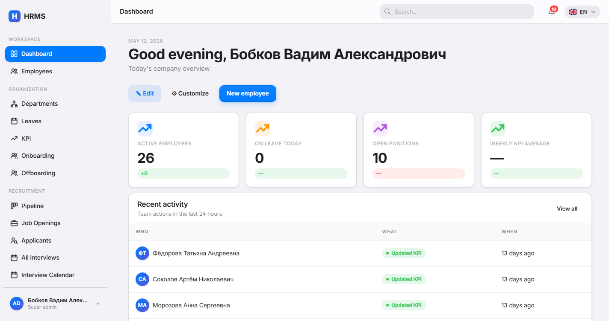

### Recruitment Kanban
Drag-and-drop pipeline. AI scores each applicant on resume upload.
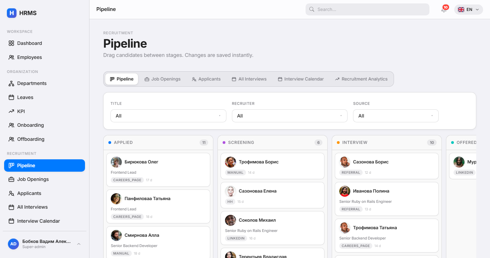

### Recruitment Analytics
Conversion funnel + time-in-stage + recruiter performance.
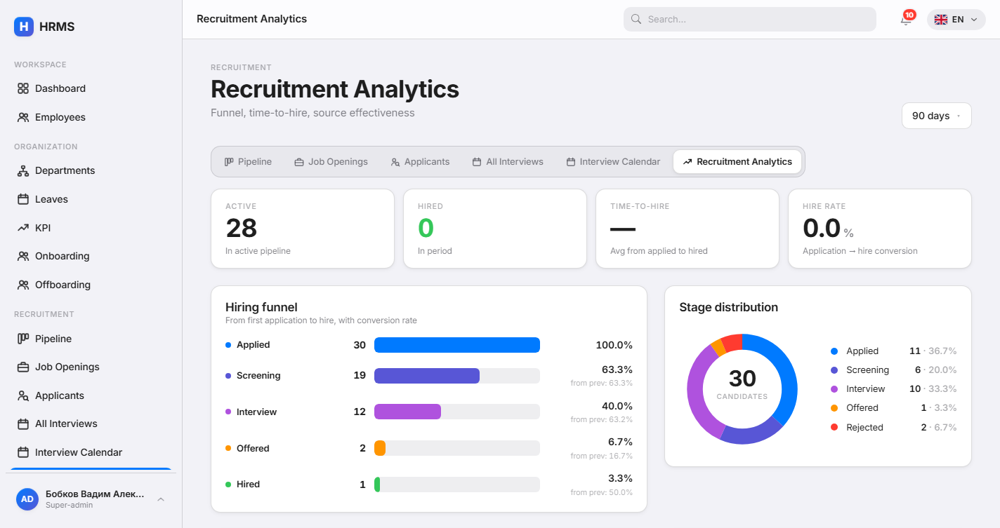

### Interview Calendar
FullCalendar 6 with hover-popover, drag-to-create, agenda.
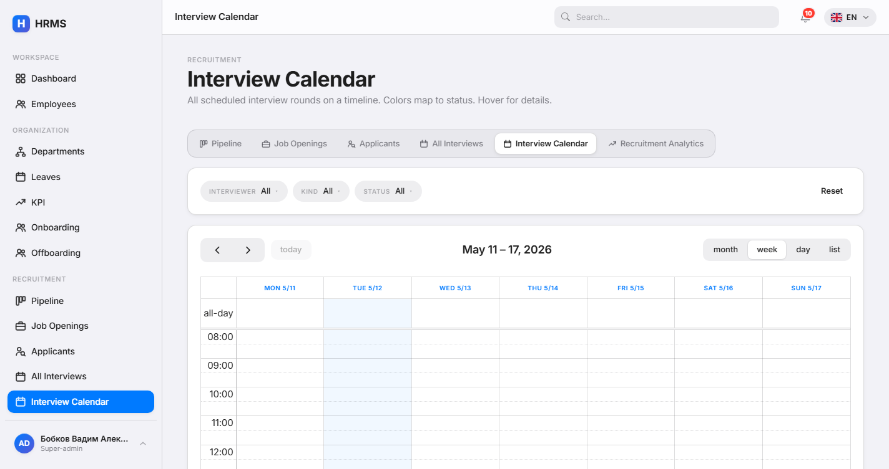

### KPI Dashboard
Weekly assignments, evaluations, trend, AI brief generator.
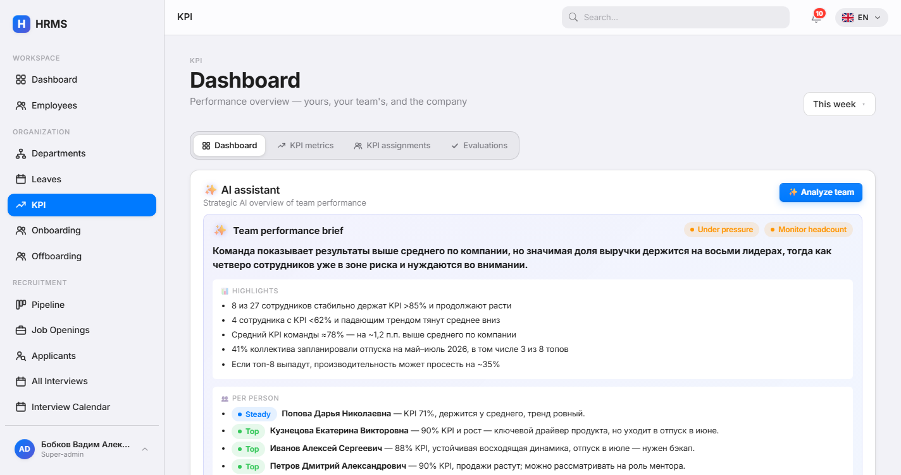

### Dark mode
Full dark theme — applies to every screen.

| Dashboard | Recruitment Kanban |
|---|---|
| 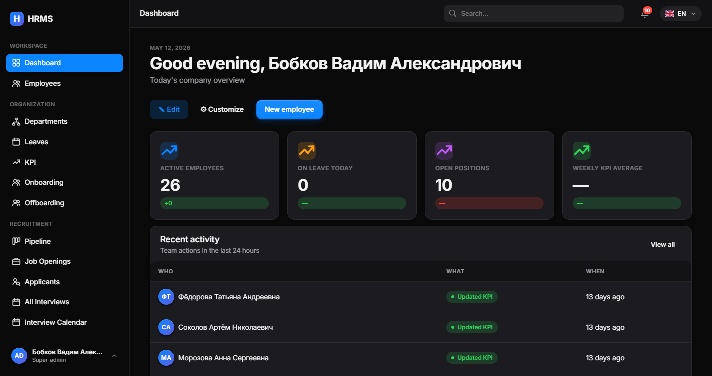 | 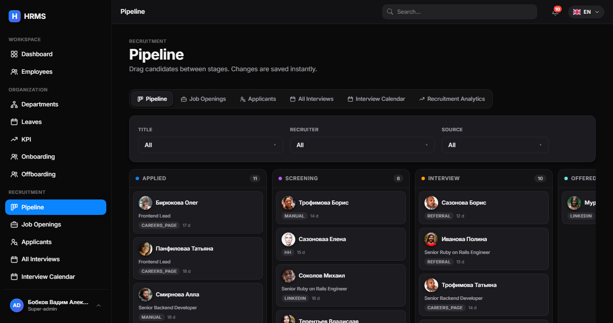 |

| KPI Dashboard | Interview Calendar |
|---|---|
| 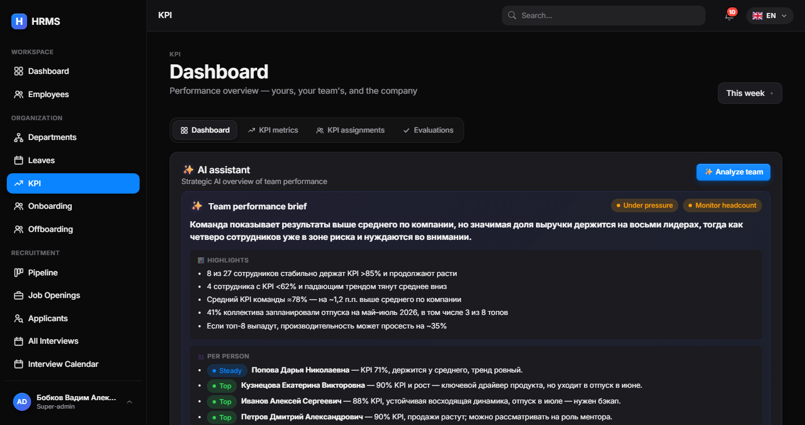 | 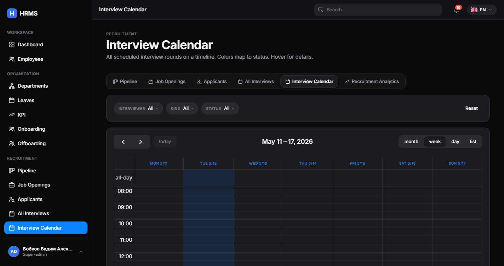 |

<details>
<summary><strong>More screenshots</strong></summary>

#### Employees
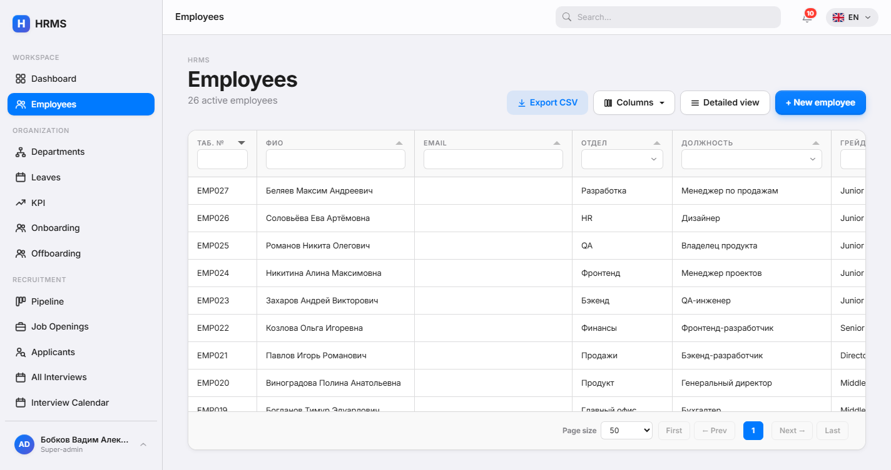

#### Leave Requests
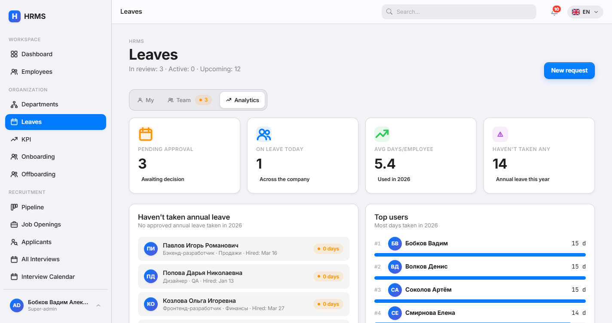

#### Documents
Upload → parse (pdf-reader + Tesseract + Vision API) → review → apply.
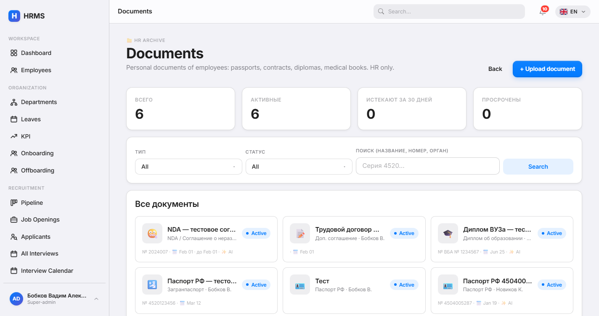

#### Onboarding Processes
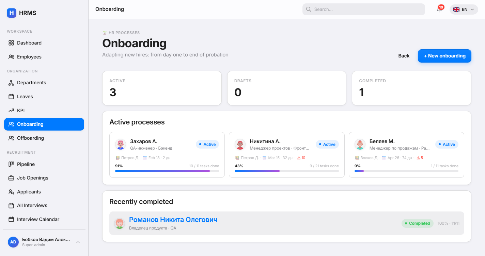

#### Audit log
Every model change tracked + revertable.
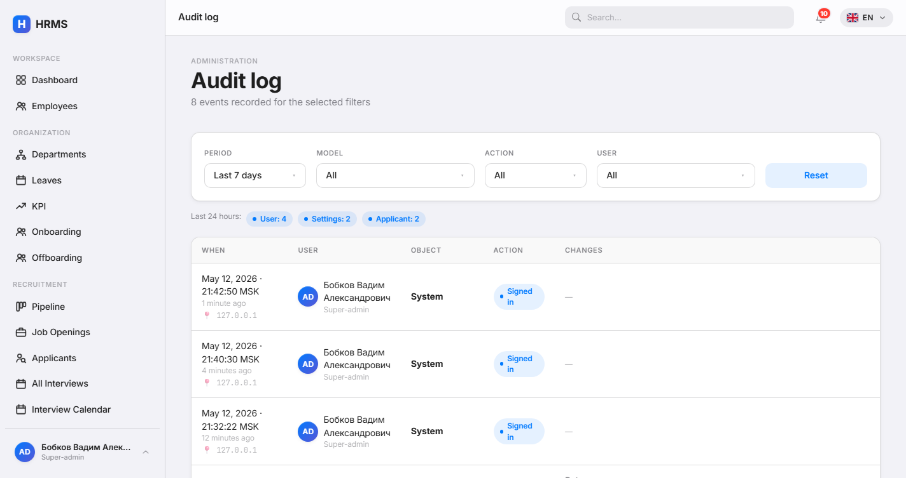

#### Self-service profile
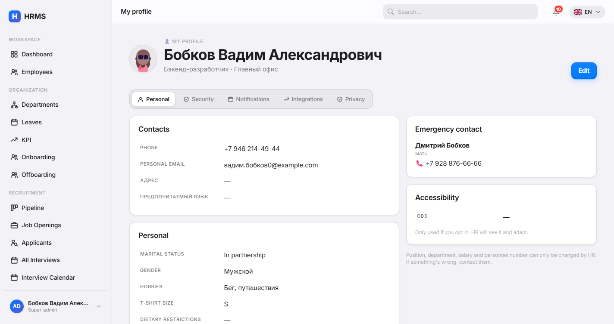

#### Slack + Telegram integrations
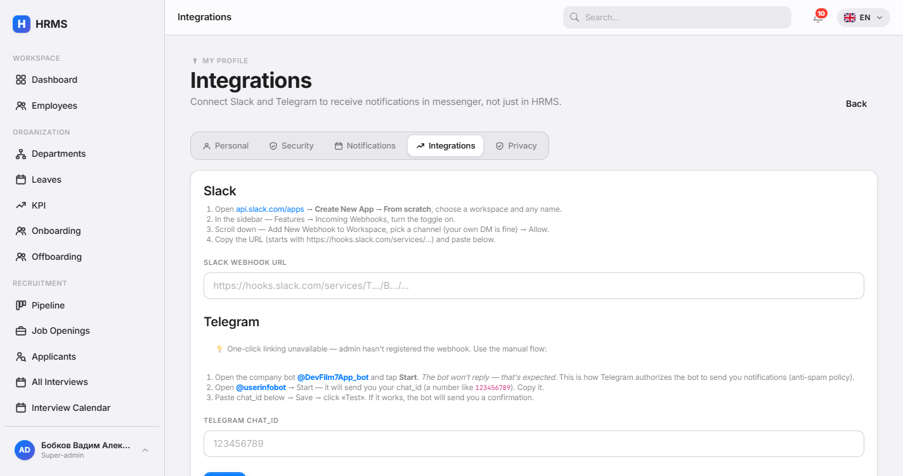

#### Settings — Languages
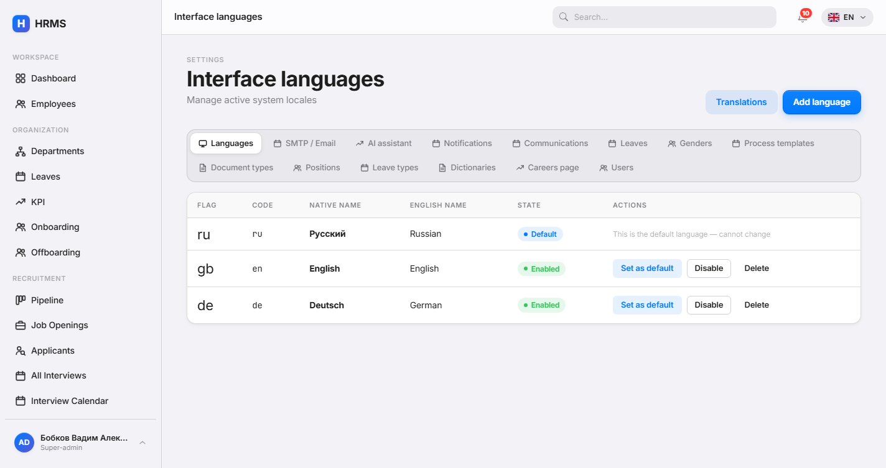

#### Settings — AI provider
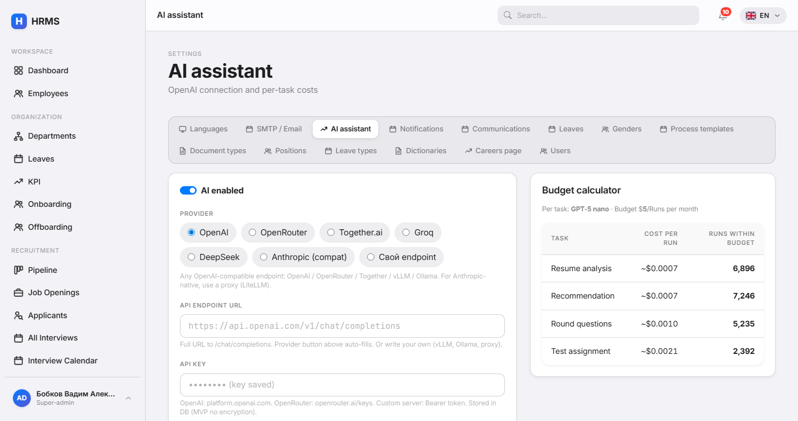

#### AI Runs log
Every AI invocation tracked: tokens, cost, model, prompt, response, status.
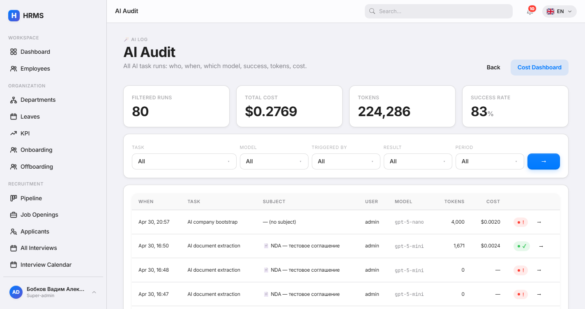

</details>

> Want to regenerate? With the server running, execute `bin/rails screenshots`. The Rake task signs in as admin and captures all key pages at 1440×900 in three locales (RU / EN / DE) + dark variants of hero shots, saving to `docs/screenshots/{ru,en,de}/`.

## Quick install (Docker)

```bash
git clone https://github.com/dripips/hrms.git
cd hrms
./scripts/install.sh
```

That's it. The installer:

1. Generates random `RAILS_MASTER_KEY` and PostgreSQL password
2. Builds the image (Tesseract OCR + poppler + libvips included)
3. Starts `db + app + worker` containers
4. Creates the first superadmin
5. Prints the URL and credentials

Open http://localhost:3000 and sign in.

## Public API

Interactive Swagger UI docs live at **`/api-docs/`** on every running instance.

**Public (no auth)** — embed careers page, lookup data:

```bash
curl /api/v1/openings | jq '.data[] | .title'
curl /api/v1/openings/JOB-0001
curl /api/v1/config?locale=en
curl /api/v1/departments
curl /api/v1/positions
```

**Authenticated (Bearer token)** — self-service for any user:

```bash
# Generate token in HRMS UI → Profile → Security → API tokens → "Issue"
TOKEN="hrms_xxx_yyy"

curl -H "Authorization: Bearer $TOKEN" /api/v1/me
curl -H "Authorization: Bearer $TOKEN" /api/v1/me/kpi
curl -H "Authorization: Bearer $TOKEN" /api/v1/me/leave_requests
curl -H "Authorization: Bearer $TOKEN" /api/v1/me/documents
curl -H "Authorization: Bearer $TOKEN" /api/v1/me/notifications

# Apply for a leave
curl -X POST -H "Authorization: Bearer $TOKEN" -H "Content-Type: application/json" \
  -d '{"leave_type_id":1,"started_on":"2026-08-01","ended_on":"2026-08-14","reason":"Vacation"}' \
  /api/v1/me/leave_requests

# Update profile
curl -X PATCH -H "Authorization: Bearer $TOKEN" \
  -d "locale=en&time_zone=Berlin" /api/v1/me
```

Tokens are **shown once** when created, stored only as bcrypt hashes — even a compromised DB won't leak working tokens. Format: `hrms_<8-char-prefix>_<64-hex-raw>`.

Full spec: [`public/api-docs/openapi.yaml`](public/api-docs/openapi.yaml).

## Modules

| Module | What it does |
|---|---|
| **Documents** | Upload, auto-parse (gem regex + AI Vision), apply with edits, expiry notifications |
| **Recruitment** | Openings, applicants, kanban pipeline, interview rounds with scorecards, public careers page, calendar, analytics |
| **KPI** | Weekly metric assignments, evaluations, leaderboard, trend dashboard |
| **Leaves** | Configurable approval rules with priority chains, balance tracking, burnout analytics |
| **Onboarding / Offboarding** | Process templates with milestone-grouped tasks, AI-augmented plans, exit risk |
| **Dictionaries** | Universal company-scoped lookup lists + custom field schemas + AI seed |
| **Audit log** | Every change tracked + revertable; AI run history with drill-downs |
| **Profile** | Self-service portal — employees edit their own contacts, emergency contact, accessibility |
| **Settings** | Languages, SMTP, AI providers (OpenAI / OpenRouter / Anthropic / Custom), notifications, careers, leave rules, document types, positions, leave types |

## The Custom Fields system

Each entity supports `custom_fields` (jsonb). Schemas are defined as **Dictionaries** with `kind: field_schema` and `code: "<Model>:<scope>"`.

Example flow for a septic-pumping company:

```
HR opens /settings/dictionaries
  → "+ Schema" → Code: Employee:default
  → AI helper: "septic service in Moscow region, 12 drivers, mandatory medical book"
  → AI proposes 5 fields:
      - driver_license_class (select: B, C, D, E)
      - adr_license_until (date)
      - medical_book_until (date, required)
      - hazardous_work_clearance (boolean)
      - uniform_size (select)
  → Approve all → fields appear on every Employee form immediately.
```

The same mechanism works for `Document:N` (one schema per document type), `JobApplicant:opening_id` (per-vacancy fields), `LeaveRequest:leave_type_id`, `Department:default`, `Position:default`, `LeaveType:default`.

## AI agents

24 agents across the lifecycle. Two newest:

- **`company_bootstrap`** — chat-style consultant that interviews HR about the company and proposes the full dictionary configuration
- **`dictionary_seed`** — seeds entries for one specific dictionary

Plus the lifecycle:

| Domain | Agents |
|---|---|
| Recruitment | `analyze_resume`, `recommend`, `generate_assignment`, `questions_for`, `summarize_interview`, `compare_candidates`, `offer_letter` |
| Employee retention | `burnout_brief`, `suggest_leave_window`, `kpi_brief`, `meeting_agenda`, `kpi_team_brief`, `compensation_review`, `exit_risk_brief` |
| Onboarding | `onboarding_plan`, `welcome_letter`, `mentor_match`, `probation_review` |
| Offboarding | `knowledge_transfer_plan`, `exit_interview_brief`, `replacement_brief` |
| Documents | `document_summary`, `document_extract_assist` (with Vision API for images) |

A server-side **AiLock** prevents duplicate runs across browser tabs.

### AI providers

Switch providers in **Settings → AI**. Pre-configured presets:

- OpenAI (default) — `gpt-5-nano`, `gpt-5-mini`, `gpt-5`, `o3`
- OpenRouter — Qwen, Claude, Llama, DeepSeek, Gemini
- Together.ai — Qwen-Turbo, Llama-Turbo, DeepSeek-V3
- Groq — Llama-3.3, Qwen-QwQ, DeepSeek-R1
- DeepSeek (native)
- Anthropic (via LiteLLM proxy)
- Custom — any OpenAI-compatible endpoint (vLLM, Ollama, your inference server)

Per-task model override: pick `gpt-5-mini` for `company_bootstrap` (better at multi-step reasoning) and `gpt-5-nano` for everything else (cheap and fast).

## Stack

- **Rails 8.1** + Hotwire (Turbo, Stimulus) + Bootstrap 5.3 (overridden by Apple design tokens)
- **PostgreSQL 18** + Solid Queue + Solid Cable
- **Devise** + **Pundit** + **paper_trail** + **Discard** + **AASM**
- **noticed** for in-app notifications + email mailers
- **pdf-reader** + **rtesseract** for document parsing
- **dartsass-rails** + custom design system submodule
- **RSpec** + FactoryBot + Capybara

## Manual install (without Docker)

Prerequisites: **Ruby 4.0.3**, **PostgreSQL 18**, **Tesseract OCR** (with `tesseract-ocr-rus` and `tesseract-ocr-eng`), **Poppler** (`pdftoppm` for scan-PDF OCR).

```bash
git clone https://github.com/dripips/hrms.git
cd hrms

# Configure database in config/database.yml or .env.development.local
bundle install
bin/rails db:create db:migrate db:seed

bin/dev   # Rails + dartsass watcher + Solid Queue
```

Default seeded users (password: `password123`):
- `admin@hrms.local` — superadmin
- `hr@hrms.local` — HR specialist
- `manager@hrms.local` — manager
- `alice@hrms.local` — regular employee

## Architecture notes

- **Live UI**: controller actions broadcast via `Turbo::StreamsChannel`. AI jobs use `AiLock` + `broadcast_controls` for per-tab in-flight indicators.
- **i18n**: Russian primary; EN/DE fall back to RU. All three locales kept at exact key parity (2094 keys each as of v1.0).
- **AI cost ceiling**: every AiRun records token usage and dollar cost. Settings → AI shows per-task / per-model breakdown for the current month.
- **SMTP runtime config**: `ApplicationMailer#apply_runtime_smtp` reads `AppSetting(category: "smtp")` per request — change SMTP in UI without restarting.
- **No 2FA** by design (yet) — relies on strong passwords + RBAC. Add via Devise extension if needed for production.

## Roadmap

- ☐ Multi-tenant routing (subdomain per company)
- ☐ Mobile-first review screen
- ☐ Slack/Telegram delivery channel for notifications
- ☐ Public job board enhancements
- ☐ RSpec coverage push to >80%
- ☐ PDF scan→OCR pipeline (poppler + Tesseract for image-PDFs)

## Contributing

Pull requests welcome. The project follows Apple-HIG SCSS tokens — no naked Bootstrap. Animations must use spring easing. New i18n keys go to all three locales (`tmp/sync_locales.rb` is a helper script for bulk additions).

## License

MIT — see [LICENSE](LICENSE).

## Author

[Vadim Bobkov](https://github.com/dripips) — built this as part of the [`rubby`](https://github.com/dripips?tab=repositories&q=rubby) learning umbrella while shipping production code in PHP, Java, Python, and TypeScript elsewhere.
