# HRMS

[English](README.md) · [Русский](README.ru.md) · [Deutsch](README.de.md)

**Универсальная HRMS для любой индустрии — от tech-стартапа до септик-сервиса.** Open source, self-hosted, с AI-ассистентом, дружелюбна к регуляторам (152-ФЗ, GDPR).

Rails 8 · Hotwire · 24 AI-агента · Apple-HIG · Три локали · Установка в одну команду через Docker.

   

---

## Зачем

Большинство HR-систем зашивают словарь одной индустрии в код. Сотрудник — «разработчик», отпуск — «PTO», документ — «паспорт». Реальные компании сложнее: у септик-сервиса нужны категории ВУ и ADR-допуски; у частной клиники — номера лицензий; у tech-стартапа — GitHub URL'ы. Каждая компания — *своя* версия HR.

**HRMS гнётся под компанию, а не наоборот.** У каждой сущности (Сотрудник, Должность, Документ, Заявка на отпуск, Кандидат, Отдел) есть универсальный механизм **Доп.полей** через Справочники. HR определяет схему один раз — формы, валидация, AI-извлечение и аудит подхватывают её автоматически.

## Главное

- 🌍 **Универсально по индустриям.** Доп.поля для каждой сущности, настраиваемые списки, всё company-scoped.
- 🪄 **24 AI-агента** на весь жизненный цикл сотрудника, работают на **любом OpenAI-compatible endpoint** — OpenAI, OpenRouter, Together, Groq, DeepSeek, vLLM, Ollama, свой сервер.
- 📄 **Раздел документов** с авто-разбором (pdf-reader + Tesseract OCR + OpenAI Vision как fallback), AI-сводкой, отслеживанием срока действия, email-уведомлениями.
- 🤖 **AI Bootstrap чат** — расскажи про компанию обычным текстом, AI предложит полный набор полей и справочников под твою индустрию. Подтверди что нужно.
- ⚡ **Реактивный UI** — каждое изменение через Turbo + ActionCable. Без перезагрузок страниц.
- 🎨 **Apple-HIG дизайн-система** — системные цвета, SF Pro, spring-анимации.
- 🌐 **Три локали (RU / EN / DE)** с автоматической цепочкой fallback. AI отвечает на локали пользователя.
- 📊 **Cost dashboard** — реальные траты на AI по задачам, моделям, пользователям.
- 🔐 **Audit log** + Pundit RBAC + soft-delete + revert.
- 📧 **Email-уведомления** с настраиваемым через UI SMTP.
- 🐳 **Установка одной командой** через Docker, секреты генерируются автоматически.

## Скриншоты

### Дашборд
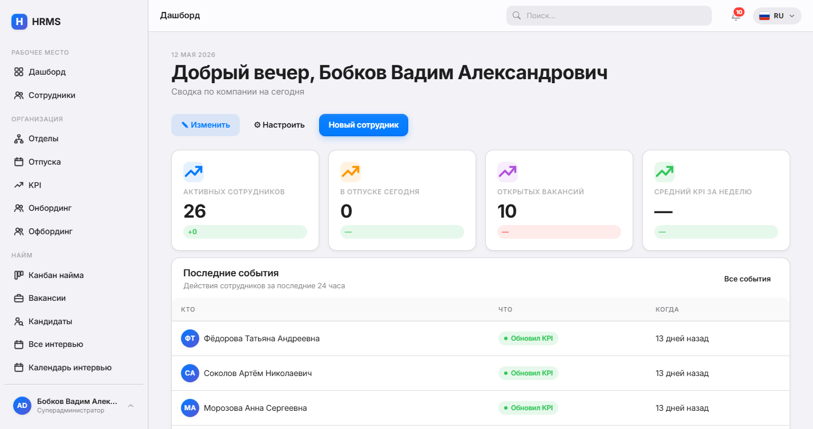

### Канбан найма
Drag-and-drop пайплайн. AI скорит каждого кандидата при загрузке резюме.
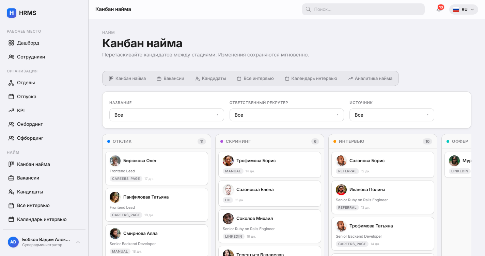

### Аналитика найма
Воронка конверсии, время в стадии, перформанс рекрутеров.
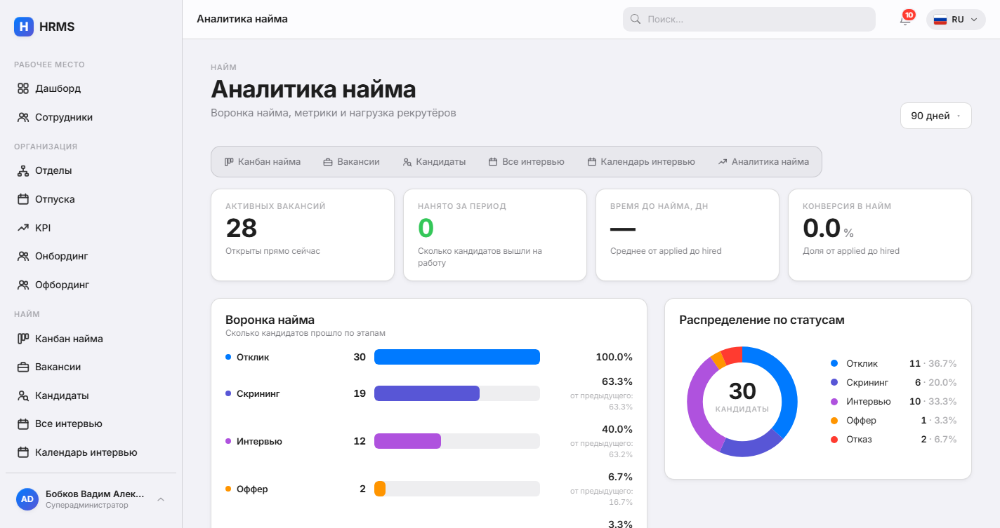

### Календарь интервью
FullCalendar 6 с hover-popover, drag-to-create, agenda.
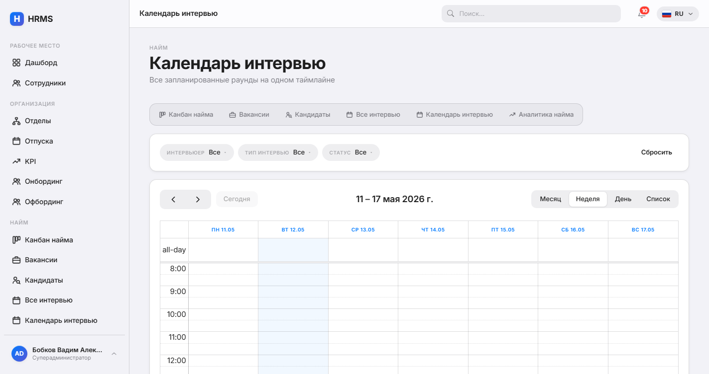

### KPI Dashboard
Недельные назначения, оценки, тренд, AI-генератор брифа.
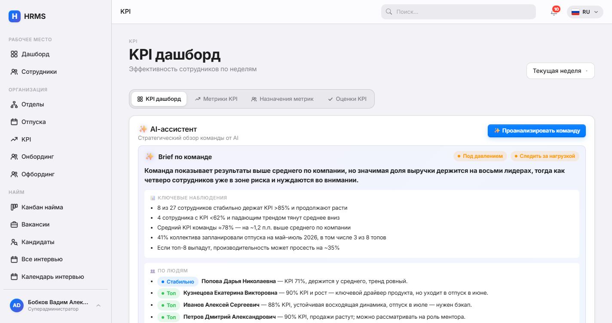

### Тёмная тема
Полностью поддерживается — применяется ко всем экранам.

| Дашборд | Канбан найма |
|---|---|
| 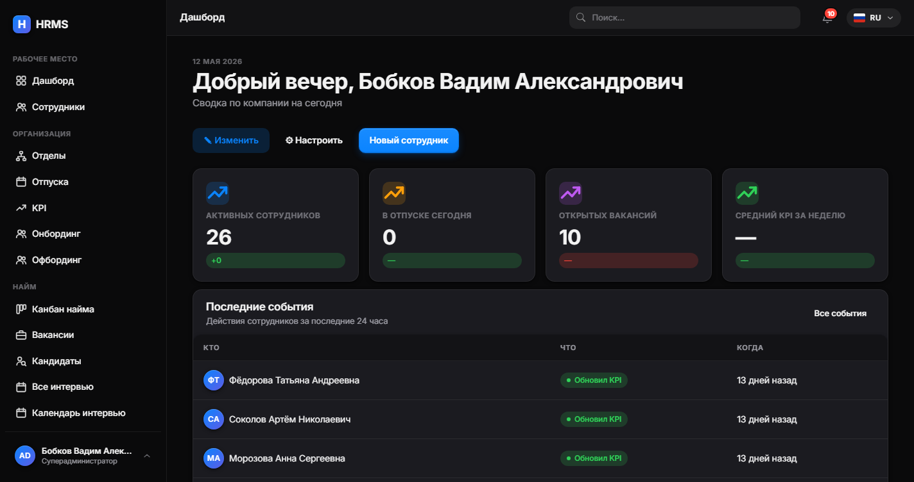 | 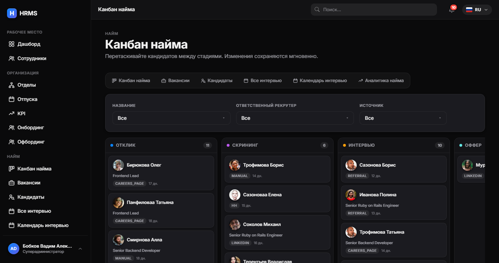 |

| KPI | Календарь интервью |
|---|---|
| 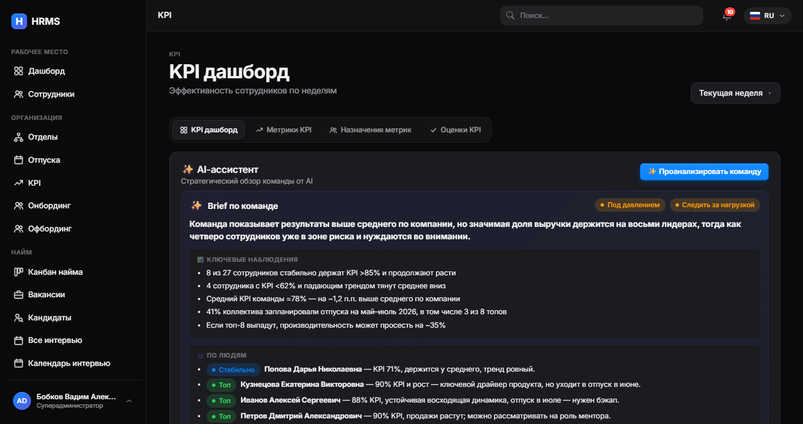 | 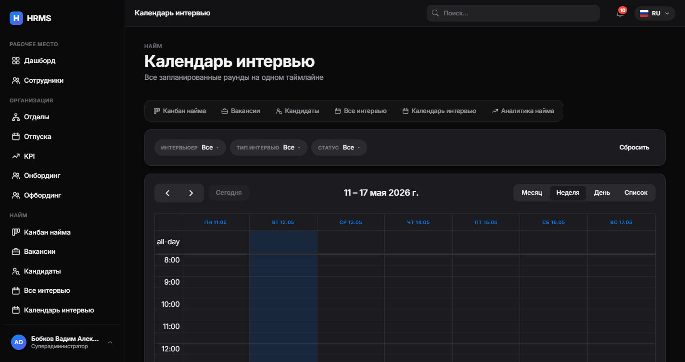 |

<details>
<summary><strong>Ещё скриншоты</strong></summary>

#### Сотрудники
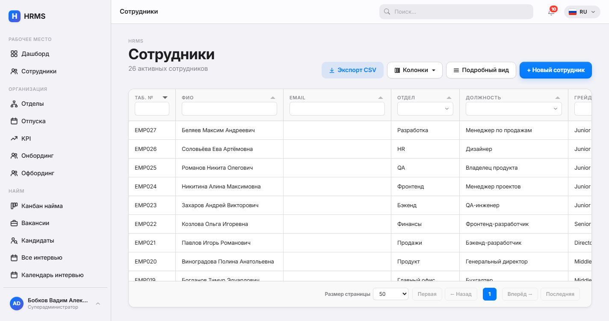

#### Отпуска
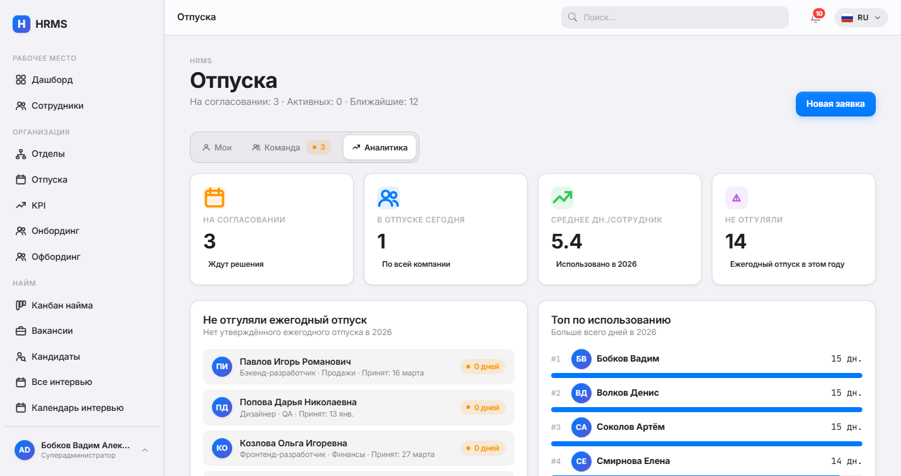

#### Документы
Загрузка → разбор (pdf-reader + Tesseract + Vision API) → ревью → применение.
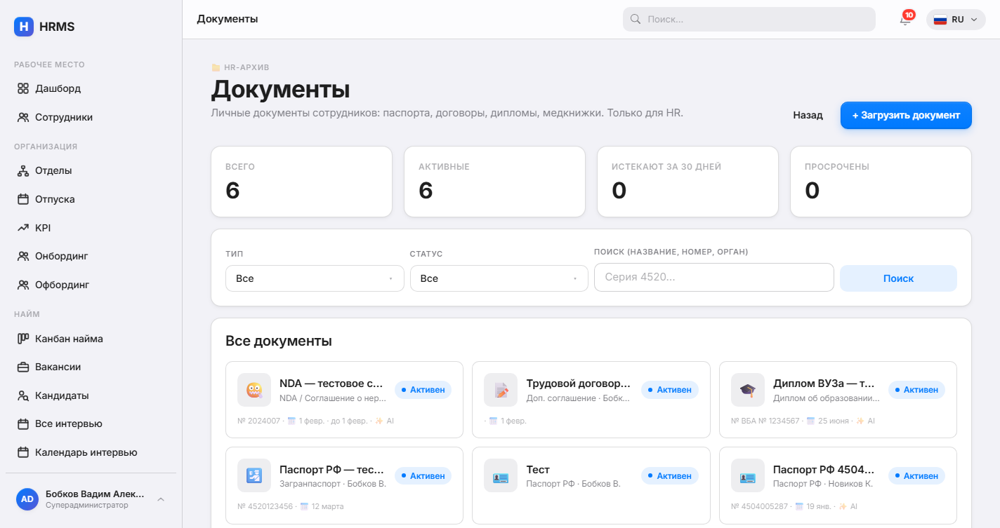

#### Онбординг процессы
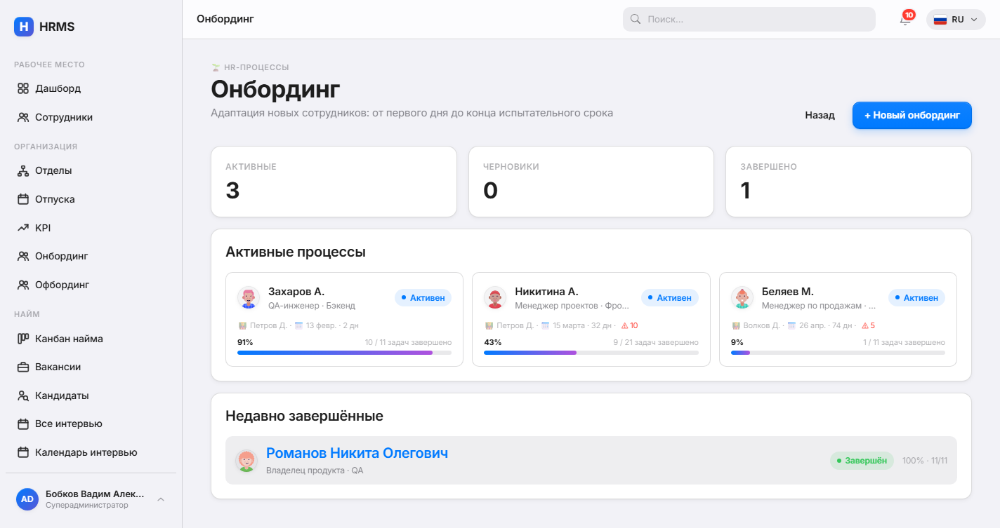

#### Audit log
Каждое изменение модели отслеживается + revertable.
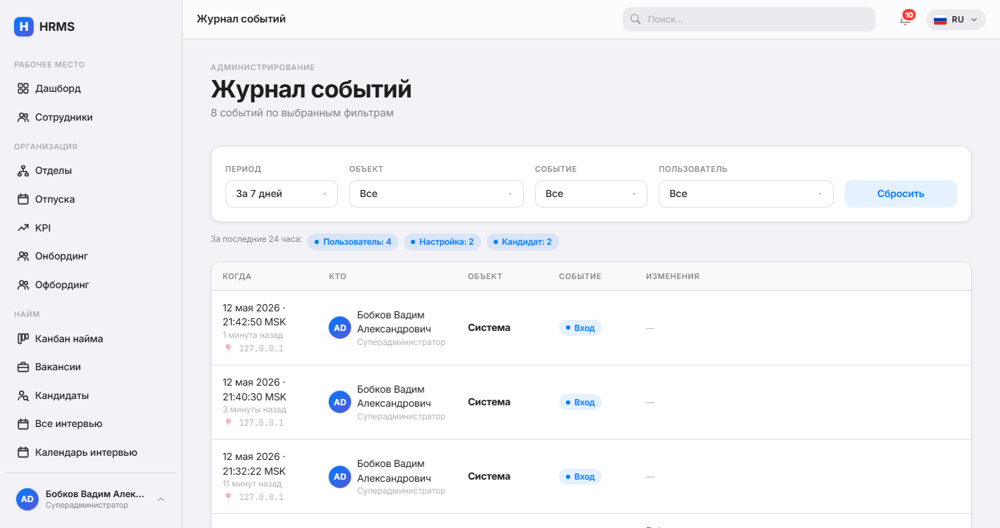

#### Self-service профиль
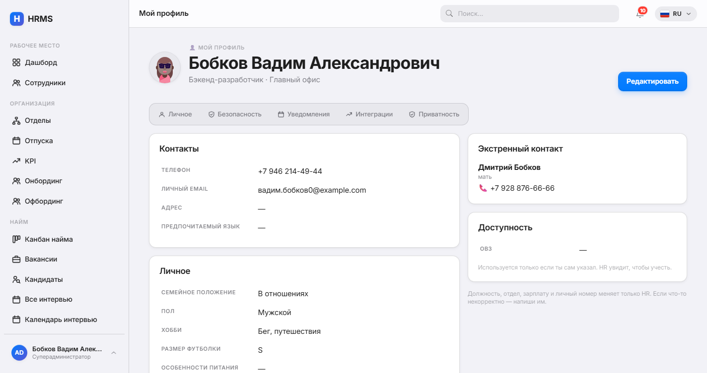

#### Slack + Telegram интеграции
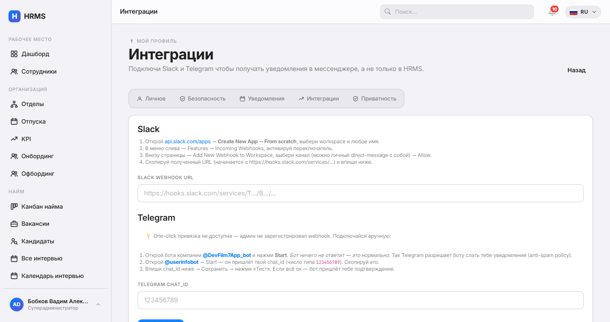

#### Настройки — Языки
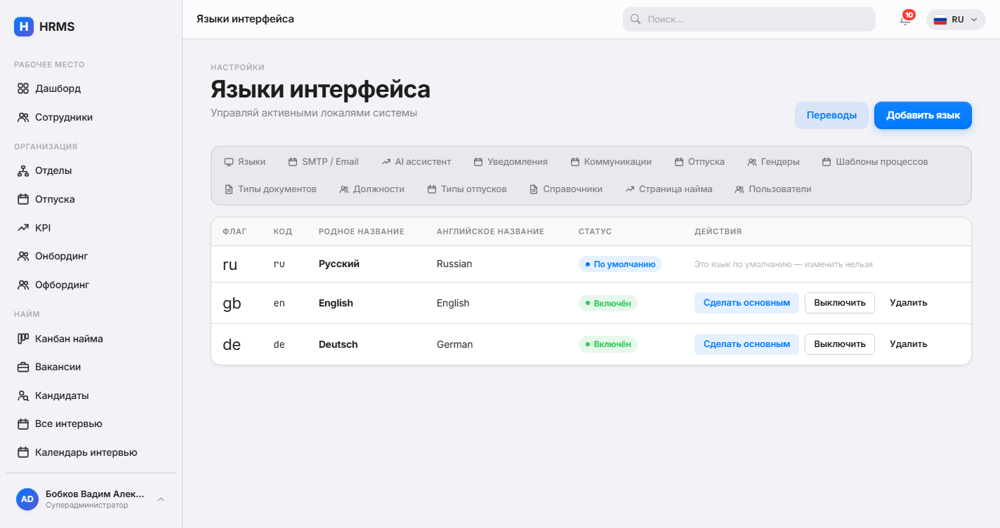

#### Настройки — AI-провайдер
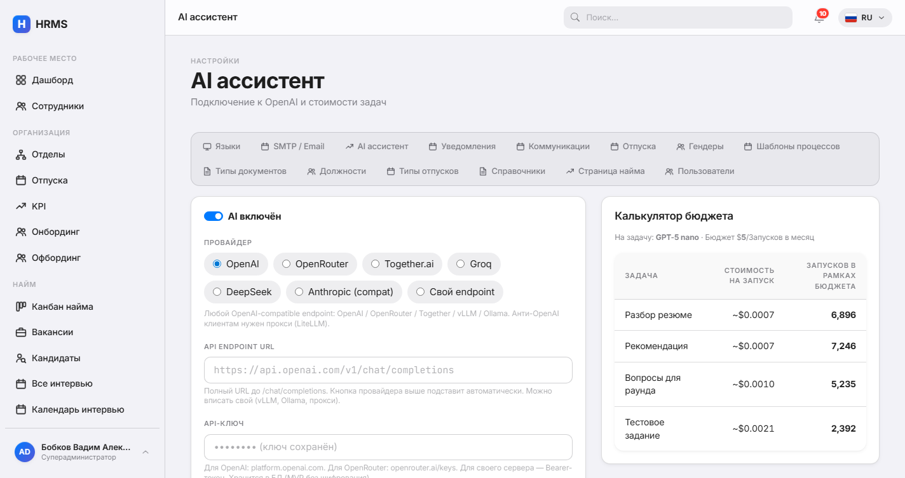

#### AI Runs log
Каждый AI-запуск с токенами, стоимостью, моделью, prompt'ом, response'ом и статусом.
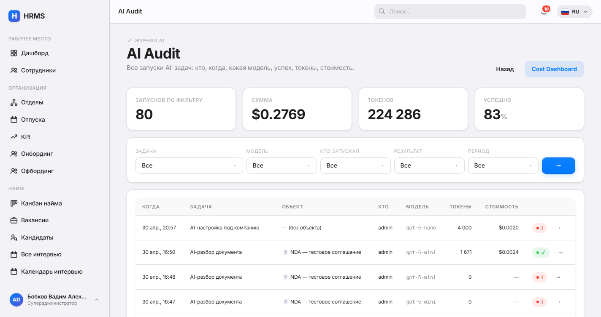

</details>

> Хочешь пересобрать? При работающем сервере запусти `bin/rails screenshots`. Rake-таск заходит как admin и снимает все ключевые страницы в 1440×900 на трёх локалях (RU / EN / DE) + dark-варианты hero-экранов в `docs/screenshots/{ru,en,de}/`.

## Быстрая установка (Docker)

```bash
git clone https://github.com/dripips/hrms.git
cd hrms
./scripts/install.sh
```

Готово. Установщик:

1. Сгенерит случайные `RAILS_MASTER_KEY` и пароль PostgreSQL
2. Соберёт образ (Tesseract OCR + poppler + libvips включены)
3. Запустит `db + app + worker` контейнеры
4. Создаст первого superadmin'а
5. Выведет URL и доступы

Открой http://localhost:3000 и заходи.

## Модули

| Модуль | Что делает |
|---|---|
| **Документы** | Загрузка, авто-разбор (regex + AI Vision), применение с правками, уведомления об истечении |
| **Recruitment** | Вакансии, кандидаты, kanban-pipeline, раунды интервью со scorecard, публичная careers-страница, календарь, аналитика |
| **KPI** | Еженедельные метрики, оценки, leaderboard, тренды |
| **Отпуски** | Настраиваемые правила согласования с приоритетами, баланс, аналитика выгорания |
| **Онбординг / Офбординг** | Шаблоны процессов с задачами по этапам, AI-планы, exit risk |
| **Справочники** | Универсальные company-scoped списки + схемы доп.полей + AI seed |
| **Audit log** | Каждое изменение трекается + revert; история AI-вызовов с drill-down'ами |
| **Профиль** | Self-service портал — сотрудник правит свои контакты, экстренный контакт, доступность |
| **Настройки** | Языки, SMTP, AI-провайдеры (OpenAI / OpenRouter / Anthropic / свой), уведомления, careers, правила отпусков, типы документов, должности, типы отпусков |

## Система Custom Fields

У каждой сущности есть `custom_fields` (jsonb). Схемы определяются как **Справочники** с `kind: field_schema` и `code: "<Модель>:<scope>"`.

Пример для септик-сервиса:

```
HR заходит в /settings/dictionaries
  → "+ Схема" → Code: Employee:default
  → AI helper: "септик-сервис в Подмосковье, 12 водителей, обязательная мед.книжка"
  → AI предлагает 5 полей:
      - driver_license_class (select: B, C, D, E)
      - adr_license_until (date)
      - medical_book_until (date, обязательное)
      - hazardous_work_clearance (boolean)
      - uniform_size (select)
  → Применить всё → поля появляются в форме каждого сотрудника сразу.
```

Тот же механизм для `Document:N` (одна схема на тип документа), `JobApplicant:opening_id` (под вакансию), `LeaveRequest:leave_type_id`, `Department:default`, `Position:default`, `LeaveType:default`.

## AI-агенты

24 агента на весь жизненный цикл. Два самых новых:

- **`company_bootstrap`** — чат-консультант, интервьюирует HR про компанию и предлагает полную конфигурацию словарей
- **`dictionary_seed`** — наполняет один конкретный словарь записями

Плюс жизненный цикл:

| Домен | Агенты |
|---|---|
| Рекрутинг | `analyze_resume`, `recommend`, `generate_assignment`, `questions_for`, `summarize_interview`, `compare_candidates`, `offer_letter` |
| Удержание | `burnout_brief`, `suggest_leave_window`, `kpi_brief`, `meeting_agenda`, `kpi_team_brief`, `compensation_review`, `exit_risk_brief` |
| Онбординг | `onboarding_plan`, `welcome_letter`, `mentor_match`, `probation_review` |
| Офбординг | `knowledge_transfer_plan`, `exit_interview_brief`, `replacement_brief` |
| Документы | `document_summary`, `document_extract_assist` (с Vision API для картинок) |

Серверный **AiLock** не даёт запустить ту же задачу дважды (даже из разных вкладок).

### AI-провайдеры

Переключаются в **Настройки → AI**. Готовые пресеты:

- OpenAI (по умолчанию) — `gpt-5-nano`, `gpt-5-mini`, `gpt-5`, `o3`
- OpenRouter — Qwen, Claude, Llama, DeepSeek, Gemini
- Together.ai — Qwen-Turbo, Llama-Turbo, DeepSeek-V3
- Groq — Llama-3.3, Qwen-QwQ, DeepSeek-R1
- DeepSeek (native)
- Anthropic (через LiteLLM прокси)
- Custom — любой OpenAI-compatible endpoint (vLLM, Ollama, свой сервер)

Override модели на задачу: `gpt-5-mini` для `company_bootstrap` (лучше с meta-rules) и `gpt-5-nano` на остальное (дёшево и быстро).

## Стек

- **Rails 8.1** + Hotwire (Turbo, Stimulus) + Bootstrap 5.3 (под Apple-токены)
- **PostgreSQL 18** + Solid Queue + Solid Cable
- **Devise** + **Pundit** + **paper_trail** + **Discard** + **AASM**
- **noticed** для in-app + email уведомлений
- **pdf-reader** + **rtesseract** для разбора документов
- **dartsass-rails** + дизайн-система через сабмодуль
- **RSpec** + FactoryBot + Capybara

## Ручная установка (без Docker)

Требования: **Ruby 4.0.3**, **PostgreSQL 18**, **Tesseract OCR** (с `tesseract-ocr-rus` и `tesseract-ocr-eng`), **Poppler** (`pdftoppm` для скан-PDF).

```bash
git clone https://github.com/dripips/hrms.git
cd hrms

# Настрой БД в config/database.yml или .env.development.local
bundle install
bin/rails db:create db:migrate db:seed

bin/dev   # Rails + dartsass watcher + Solid Queue
```

Засеяные пользователи (пароль: `password123`):
- `admin@hrms.local` — superadmin
- `hr@hrms.local` — HR
- `manager@hrms.local` — менеджер
- `alice@hrms.local` — рядовой сотрудник

## Архитектура

- **Реактивный UI**: контроллеры делают broadcast через `Turbo::StreamsChannel`. AI-задачи используют `AiLock` + `broadcast_controls` для in-flight индикаторов в каждой вкладке.
- **i18n**: русский — основной; EN/DE fallback на ru. Все три локали поддерживаются в строгой парности (2094 ключа каждая на v1.0).
- **AI cost-ceiling**: каждый AiRun пишет токены и стоимость в долларах. Настройки → AI показывает разбивку за месяц.
- **SMTP runtime-конфиг**: `ApplicationMailer#apply_runtime_smtp` читает `AppSetting(category: "smtp")` на каждый запрос — менять SMTP можно через UI без рестарта.
- **2FA пока нет** by design — упор на сильные пароли + RBAC. Добавить через Devise extension если нужно для прода.

## Roadmap

- ☐ Multi-tenant routing (subdomain на компанию)
- ☐ Mobile-first review screen
- ☐ Slack/Telegram канал для уведомлений
- ☐ Улучшения публичной job board
- ☐ RSpec покрытие до >80%
- ☐ PDF scan→OCR pipeline (poppler + Tesseract для скан-PDF)

## Вклад

Pull request'ы приветствуются. Проект следует Apple-HIG SCSS-токенам — никакого голого Bootstrap. Анимации только через spring easing. Новые i18n ключи добавляются во все три локали сразу (`tmp/sync_locales.rb` — helper для массовых добавлений).

## Лицензия

MIT — см. [LICENSE](LICENSE).

## Автор

[Вадим Бобков](https://github.com/dripips) — построил как часть [`rubby`](https://github.com/dripips?tab=repositories&q=rubby) обучающего пакета, параллельно работая на проде в PHP / Java / Python / TypeScript.
